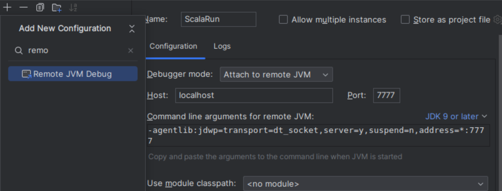

Scala Word Count
================

Key advantage of using Spark for the word count is that the operation and data is distributed over many nodes. Don't need to fit all the data into memory of one machine

# Compiling

# Running
1. Install Spark
2. Set environment variables (assuming Spark is installed to /opt/spark)
```
export SPARK_HOME="/opt/spark"
export PATH="$PATH:$SPARK_HOME/bin:$SPARK_HOME/sbin"
```
3. Run the application via spark-submit
```dtd
spark-submit --class "WordCount" --master local[4] target/scala-2.12/scalasparkwordcount_2.12-0.1.0-SNAPSHOT.jar
```
4. It will print the word count in the command output in the following form
`The counts of 5 most common words is (the,967), (of,642), (and,481), (to,318), (a,306)`

# Debugging
Steps below based on http://www.bigendiandata.com/2016-08-26-How-to-debug-remote-spark-jobs-with-IntelliJ/
2. Set environment variable `export SPARK_SUBMIT_OPTS=-agentlib:jdwp=transport=dt_socket,server=y,suspend=y,address=7777`
2. In IntelliJ IDEA, create a new run config as below 

3. Run 
```
spark-submit --class "WordCount" --master local[4] target/scala-2.12/scalasparkwordcount_2.12-0.1.0-SNAPSHOT.jar
```
4. Press the debug button on the run configuration you set up in step 2.
5. The code will run at the moment you start debugging. If successful, will hit any checkpoints you set in the code